[home](index.md)
# Books I have read:
* [Niek De Groot (serie)]

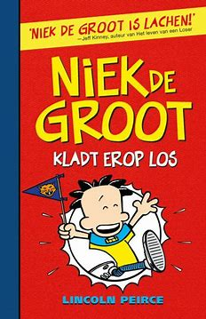

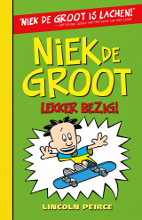

* [Flip Fiasco (serie)]

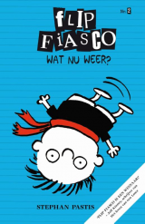

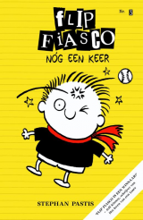

* [Het leven van een loser (serie)]
### I have read all the books of Het leven van een loser.

### [English](https://wimpykid.com/)

### [Dutch](https://www.graphic-novels.nl/boeken/het-leven-van-een-loser/)

* [Dummie de mummie (serie)]
### [I have read all the books of Dummie de Mummie.](https://dummiedemummie.nl/)

* [Harry Potter (serie)]
### I have read all the books of Harry Potter.

### [English](https://harrypotter.fandom.com/wiki/Harry_Potter)

### [dutch](https://harrypotter.fandom.com/nl/wiki/Harry_Potter_(boekenserie))

* [De Waanzinnige Boomhut (serie)]
### I have read all the books of De Waanzinnige Boomhut.

### [English](https://www.goodreads.com/book/show/12823835-the-13-storey-treehouse)

### [dutch](https://ikvindlezenleuk.nl/2018/02/griffiths-boomhut-91verdiepingen/)

# Books that I want to/still read:

## Niek De Groot serie
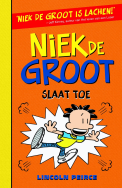
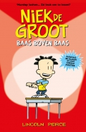
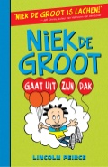
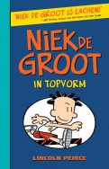
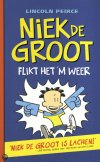
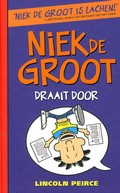
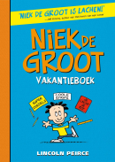
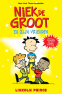

## Flip Fiasco serie
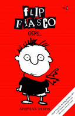
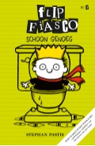

## Het leven van een loser serie
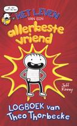

* [Donald Duck (stripserie)]
### [These books come out everyday so im still reading them](https://disney.fandom.com/wiki/Donald_Duck_in_comics)
